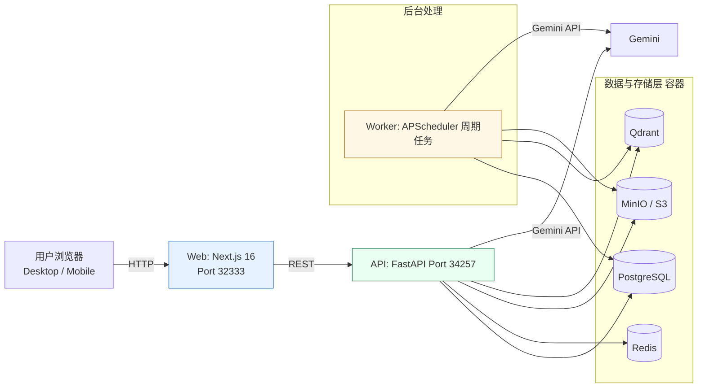
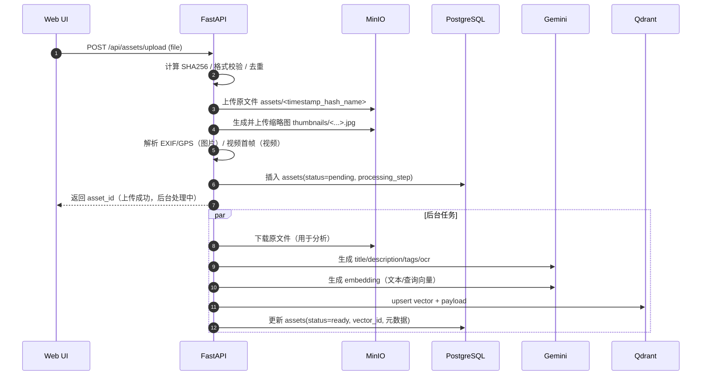
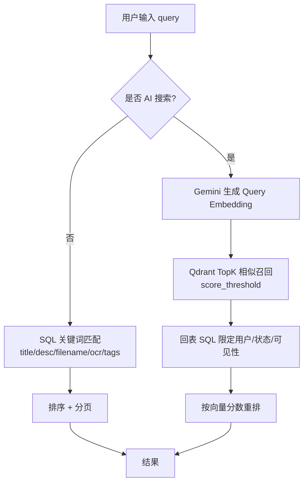
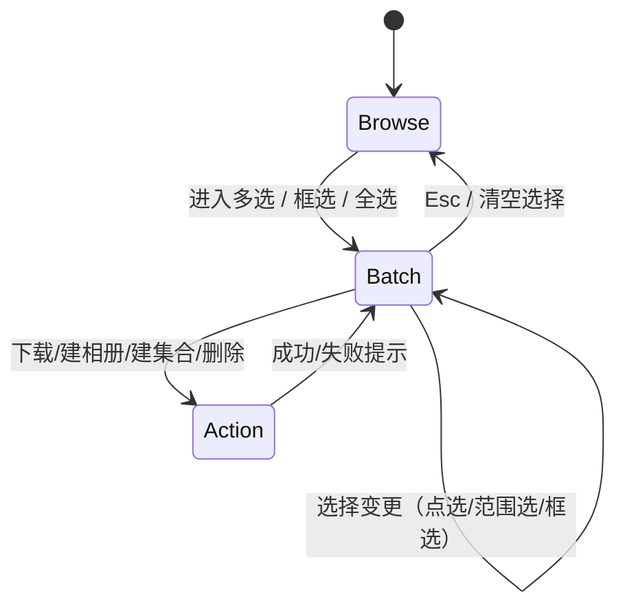
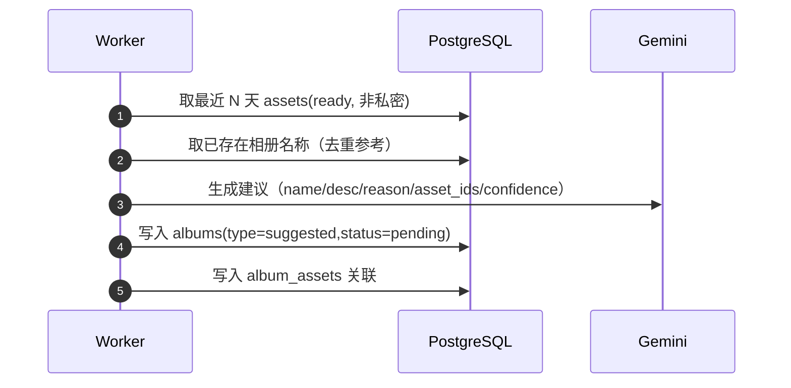

# Zmage 开发体会与小结（图文版）

> 这份文档面向“复盘与交付说明”：把项目的关键链路、架构决策、踩坑与取舍讲清楚，并给出可演进的下一步建议。  
> 项目总览与使用方式见：`README.md`；更完整的实验报告见：`report.md`。

## 目录
- 1. 一句话定位与交付闭环
- 2. 架构总览（Mermaid）
- 3. 核心链路拆解（Mermaid）
- 4. 关键实现要点（工程视角）
- 5. 开发体会：取舍、踩坑与方法论
- 6. 下一步演进建议

---

## 1. 一句话定位与交付闭环

Zmage 是一个**面向创意团队与个人的数字资产管理系统**：以“上传-整理-检索-协作分享”为主线，叠加 Gemini 驱动的自动标签、语义检索、相似推荐与相册建议，最终把“素材库”做成能持续增长的“可检索记忆”。

**可演示闭环（从用户动作出发）**：
1. 上传图片/视频 → 自动缩略图 + EXIF/GPS 提取 → 入库
2. 后台 AI 分析（标题/描述/标签/OCR）→ 写回资产元数据
3. 文本检索/语义检索（Qdrant）→ 找到资产 → 相似推荐
4. 批量操作（Ctrl/Cmd+A、Shift 范围选、拖拽框选）→ 批量下载 Zip / 加入相册 / 加入集合
5. 分享链接（可设密码/有效期）→ 对外浏览（可控下载权限）
6. 足迹地图：从 EXIF GPS 聚合展示（Leaflet）
7. Worker 定时扫描：生成“建议相册”（待用户接受/忽略）

---

## 2. 架构总览（Mermaid）

系统采用“**Web（Next.js）+ API（FastAPI）+ Worker（APScheduler）**”的分层组合，并以 Docker Compose 把多数据库/对象存储一键编排（见 `docker-compose.yml`）。

**为什么要拆 Worker？**
- API 负责“交互响应”，Worker 负责“周期性/长耗时/批量归档”——避免把耗时任务压在 Web 请求生命周期里。
- Worker 可以独立扩容、独立容错；失败不影响主业务可用性（例如相册建议失败不影响上传/检索）。

---

## 3. 核心链路拆解（Mermaid）

### 3.1 上传 → 预处理 → AI 分析 → 向量化

从实现看，上传后立即创建资产记录并进入 `pending/processing`，把 AI 与向量化放到后台流程（见 `apps/api/src/routers/assets.py`、`apps/api/src/services/asset.py`）。

**体会：把“可用”与“更聪明”解耦**  
上传的第一目标是“数据不丢、可预览、可组织”，AI 属于增强能力：即使 `GEMINI_API_KEY` 未配置，也必须保证系统可用（见 `apps/api/src/services/gemini.py` 的降级返回）。

### 3.2 检索：关键词过滤 + 语义召回

语义检索不是“替代”关键词检索，而是把自然语言理解能力叠加在结构化筛选上（见 `apps/api/src/services/asset.py`、`apps/api/src/services/vector.py`）。

**体会：向量检索要“可控”**  
仅做向量召回会导致“看似相关但用户不想要”的结果；因此必须保留“类型/文件夹/标签/时间”等硬过滤，最终让语义检索成为更强的“召回器”。

### 3.3 批量操作体验：从“能用”到“顺手”

前端的批量选择本质是一个“状态机”：进入多选模式 → 选择集合变化 → 批量动作（下载/加相册/加集合/删除）  
实现中用到了 Ctrl/Cmd+A 全选、Shift 范围选、拖拽框选（见 `apps/web/src/components/asset/asset-grid.tsx`、`apps/web/src/components/asset/batch-actions.tsx`）。

**体会：交互的“成本”来自不一致**  
一旦多选规则不统一（比如 Shift 选区与框选互相覆盖、全选无法撤销），用户会对系统失去信心；因此选择逻辑要尽量“可预测”，并配合 toast/快捷键提示降低学习成本。

### 3.4 相册建议：把“整理”变成后台习惯

Worker 周期扫描近 30 天资产，调用 Gemini 输出候选相册并写入数据库（见 `apps/worker/src/tasks.py`）。

**体会：建议不等于替用户做决定**  
相册建议必须是“可解释、可拒绝、可再生成”的：reason 与 confidence 的存在能显著提升用户接受度，也方便后续迭代策略。

---

## 4. 关键实现要点（工程视角）

### 4.1 数据一致性：以 `Asset` 为核心的“状态驱动”
- 资产状态：`pending → processing → ready / failed`，并用 `processing_step` 给前端进度提示（见 `apps/api/src/models/asset.py`、`apps/api/src/routers/assets.py`）。
- 存储与数据库分离：文件落 MinIO，元数据落 PostgreSQL；URL 通过 API 代理与预签名机制统一输出（见 `apps/api/src/services/storage.py`）。

### 4.2 可靠性：AI 输出不稳定是常态
- 模型返回 JSON 可能被“代码围栏（fenced code block）”包裹；需做“去围栏 + 解析失败兜底”（见 `apps/api/src/services/gemini.py`）。
- 即使 AI 不可用，上传/预览/组织必须保持可用（返回默认 title/tags）。

### 4.3 性能：把阻塞点移出事件循环
- 图片/视频缩略图与哈希计算属于 CPU/IO 重活：通过 `run_in_threadpool` 转移阻塞（见 `apps/api/src/services/storage.py`、`apps/api/src/services/asset.py`）。
- 视频首帧缩略图：对“开头黑屏”的视频，尝试 seek 到 1 秒再抓帧，提高命中率（见 `apps/api/src/services/storage.py`）。

### 4.4 安全与隔离：默认“按用户划分”
- JWT 鉴权：API 关键路由默认依赖 `get_current_user`（见 `apps/api/src/utils/security.py`、`apps/api/src/main.py`）。
- 多租户隔离：资产/相册/集合/Portal 等实体引入 `user_id` 并迁移历史数据（见 `apps/api/src/migrations/*.sql`）。

### 4.5 受限环境下的工程妥协
- 地图功能使用 Leaflet CDN 引入，避免额外安装依赖（见 `apps/web/src/components/asset/map-view.tsx`）。

---

## 5. 开发体会：取舍、踩坑与方法论

### 5.1 “一键启动”不是锦上添花，是团队协作底座
把 PostgreSQL/Redis/Qdrant/MinIO 统一编排（并为 MinIO 做 bucket init、为 DB 做 healthcheck），才能让“环境一致”变成事实而不是口号（见 `docker-compose.yml`）。

### 5.2 AI 功能的关键不是“更强的模型”，而是“更稳的契约”
工程上最难的是：**让不可控的输出变得可控**。通过严格的 JSON 结构、降级与重试、以及“失败不阻塞主链路”，AI 才能从 Demo 走向长期可用。

### 5.3 体验优化要围绕“高频动作”
图库产品的高频动作只有两类：**找**与**搬**。  
找：搜索 + 筛选 + 相似推荐；搬：多选 + 批量处理 + 组织到相册/集合。围绕这两类动作打磨快捷键、提示与反馈，ROI 最高。

### 5.4 文档与实现的“版本漂移”必须被纳入流程
项目内同时存在“当前实现”和“历史方案/阶段性总结”（例如 `docs/archive/*`）。实践证明：  
当架构/端口/依赖升级后，必须明确“唯一可信文档”与“归档文档”的边界，否则新同学会在错误信息上消耗大量时间。

---

## 6. 下一步演进建议

1. **统一“任务系统”抽象**：把 API 的后台任务与 Worker 的周期任务，在数据模型与观测指标上对齐（统一 task 表、统一失败重试策略）。
2. **相册建议的用户隔离增强**：Worker 侧查询应显式按 `user_id` 分组生成建议，避免多用户场景下的交叉影响（见 `apps/worker/src/tasks.py`）。
3. **地图聚类与性能**：Leaflet 基础版已可用，后续可引入聚类/抽稀以承载更多足迹点（当前实现备注了“暂不使用聚类插件”）。
4. **更精细的搜索排序**：在“召回（Qdrant）”与“过滤（SQL）”之后，可加入轻量重排策略，让结果更贴近用户意图。
