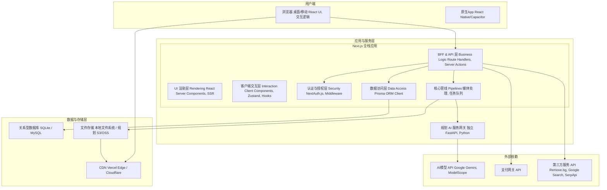

# 2.系统架构和核心原则

Zmage 的架构是一套精心设计的分层体系，旨在实现**职责分离、类型安全、性能卓越和高度可扩展性**。它以 Next.js 全栈应用为核心，将 UI 渲染、业务逻辑、数据访问和媒体处理等功能内聚，同时通过明确定义的接口与外部服务和数据存储层进行交互。

#### **前端与客户端交互层 (Browser)**

*   **核心框架与渲染**
    *   **React 19 & Next.js 15 (App Router)**: **系统骨架与渲染引擎**。负责页面渲染 (RSC)、路由管理 (App Router) 和数据变更 (Server Actions)。
*   **代码质量与类型安全**
    *   **TypeScript**: **代码质量守护者**。提供从数据库到前端的端到端类型安全，极大减少运行时错误。
*   **UI 构建与设计系统**
    *   **Tailwind CSS**: **原子化 CSS 框架**。用于快速、一致地构建响应式界面。
    *   **shadcn/ui & Radix UI**: **可访问的 UI 组件系统**。提供设计精良、功能完备、完全可控的 UI 组件，确保了 WAI-ARIA 可访问性。
*   **状态管理**
    *   **Zustand & React Hooks**: **轻量级全局状态管理器**。负责管理 UI 状态（如主题、多选模式）、用户会话信息等跨组件共享数据。
*   **表单与数据校验**
    *   **React Hook Form & Zod**: **表单与数据校验引擎**。高性能地管理表单状态，并在客户端和服务端共享同一套 Schema 实现双重数据校验。
*   **核心媒体交互**
    *   **LivePhotosKit JS (by Apple)**: **Live Photo 动态图播放器**。负责在 Web 端无缝展示和播放 Live Photo (实况照片) 的动态效果。
    *   **yet-another-react-lightbox**: **沉浸式媒体查看器**。提供图片/视频的全屏预览、手势缩放、幻灯片播放和键盘导航。
    *   **react-easy-crop**: **可视化图片裁剪工具**。在基础编辑中提供直观、可交互的图片裁剪界面。
*   **拖拽与动效**
    *   **React DnD**: **拖拽交互框架**。用于实现文件拖拽上传、相册内拖拽排序等复杂交互。
    *   **Framer Motion**: **动画库**。为页面过渡、组件加载、用户交互提供流畅、富有表现力的动画效果。

#### **后端与业务逻辑层 (Next.js Application Server)**

*   **API 与业务逻辑**
    *   **Next.js API Routes (Route Handlers)**: **业务逻辑处理中心 (BFF)**。处理客户端请求，执行核心业务逻辑，统一调度下游服务。
    *   **Next.js Server Actions**: **现代化的数据变更操作**。处理表单提交和数据修改，与 RSC 无缝集成，简化流程。
*   **认证与安全**
    *   **NextAuth.js**: **认证与会话管理器**。处理用户认证、会话管理 (JWT)，并通过中间件保护路由。
    *   **bcryptjs**: **密码哈希库**。用于安全地哈希和验证用户密码。
    *   **Helmet**: **HTTP 头安全中间件**。设置各种安全相关的 HTTP 头，防止 XSS、点击劫持等攻击。
    *   **rate-limiter-flexible**: **速率限制器**。防止暴力破解、API 滥用等攻击。
*   **数据访问**
    *   **Prisma ORM**: **类型安全的数据库桥梁**。通过 `schema.prisma` 定义数据模型，生成类型安全的 Client，并管理数据库迁移。
*   **媒体与文件处理**
    *   **Sharp**: **高性能图像处理库**。负责服务端缩略图生成、裁剪、调色、获取元数据等。
    *   **fluent-ffmpeg**: **视频处理工具包**。负责视频的封面帧提取、元数据解析、转码和剪辑等操作。
    *   **exifr**: **专业的 EXIF 元数据提取器**。深度解析照片的拍摄参数、GPS 等信息。
    *   **heic-convert**: **HEIC 格式转换器**。用于将 Apple HEIC 格式图片转换为通用的 JPEG/PNG。
    *   **unzipper / adm-zip**: **压缩文件处理器**。用于处理文件夹上传时 `.zip` 文件的解压和递归导入。
    *   **imghash / sharp-phash**: **图像哈希生成器**。用于计算感知哈希 (pHash) 和差异哈希 (dHash)，实现内容级别的图像去重。
*   **任务调度与实时通信**
    *   **BullMQ**: **专业的任务队列系统**。基于 Redis，用于处理所有耗时的后台任务（AI分析、视频转码、批量操作），提供重试、优先级和任务监控。
    *   **ws / Socket.IO**: **WebSocket 库**。用于向客户端实时推送任务进度、通知和更新。
*   **地理与日志**
    *   **node-geocoder**: **地理编码转换器**。将 GPS 经纬度坐标转换为可读的地址信息。
    *   **Pino / Winston**: **结构化日志记录器**。用于记录详细、可查询的应用程序日志，便于调试和监控。

#### **数据、存储与外部依赖**

*   **数据持久化**
    *   **SQLite / MySQL**: **元数据数据库**。存储所有结构化数据。
    *   **Redis**: **高性能键值存储**。用于缓存、会话存储和 BullMQ 任务队列。
*   **文件存储**
    *   **本地文件系统 / (规划) 对象存储 (S3/OSS)**: **二进制文件存储**。存储所有原始媒体文件。
*   **内容分发**
    *   **CDN (Vercel Edge Network / Cloudflare)**: **全球内容分发网络**。加速公开媒体资源的全球访问。
*   **AI 能力提供商 (战略性多源集成)**
    *   **基座与通用模型**:
        *   **Google Gemini (2.5 Flash/Pro, 2.0)**: 用于高质量的图像分析、描述生成、多模态理解和提示词优化。
        *   **OpenAI (GPT-4o, GPT-5)**: 用于最前沿的对话式交互、复杂场景理解和生成式创作。
        *   **Anthropic Claude 4.x (Haiku, Sonnet, Opus)**: 备选方案，用于文本摘要和对话。
    *   **高性价比与批量处理**:
        *   **Dashscope/通义千问 (阿里)**: 用于免费或低成本的大批量图像分析和标签生成任务。
    *   **高质量生成与特定任务**:
        *   **Banana.dev / Replicate**: **Serverless GPU 平台**。用于部署和调用开源社区最前沿的高质量模型（如 Stable Diffusion 变体、视频生成模型），按需付费，功能全面。
        *   **Seedream 4 (国产)**: 国产高质量图像生成模型，具备成本优势。
    *   **专业工具类 AI**:
        *   **Remove.bg**: 用于高精度的智能抠图。
        *   **美团云**:高复杂性修图任务外包。
*   **第三方生态服务**
    *   **Google Custom Search / SerpApi**: 用于"探索"功能的图片搜索。
    *   **支付网关 (Stripe / 微信支付 / 支付宝)**: 处理订阅支付。