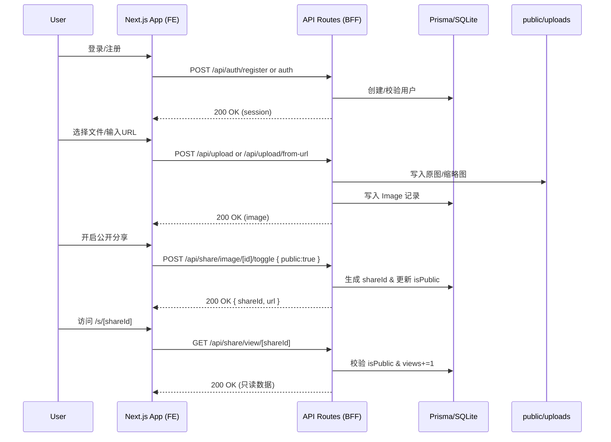

# 课程中期设计报告 · zmage 相册系统（v2.0.2）

> 项目代号：zmage · Zero Your Image  
> 版本：v2.0.2（迈入“相册阶段”的分享与视频）  
> 日期：2025-10-23  
> 作者：zzw4257  
> 仓库路径：`/Users/zzw4257/Documents/ZJU_archieve/05.课程与学术资料/BS/完整自己开发版本/`

---

## 摘要（Executive Summary）

本项目“zmage”定位为面向个人与课程实践的现代化图片（与视频）管理系统，围绕“上传-存储-展示-检索-编辑-分享”的完整生命周期，构建了以 Next.js + Prisma 为核心的全栈应用。v2.0.2 版本重点交付了“公开分享体系（分享中心/公共查看页/OG 预览）”与“视频上传能力”，并对“类型安全（Prisma）”与“登录/注册体验（动画）”进行了完善。系统已进入“真正意义上的相册阶段”，具备实用、稳定、可扩展的基础。

[截图占位：系统总体概览/信息结构图]

---

## 目录
- 1. 项目概览与目标
- 2. 系统架构与技术选型
- 3. 需求对照与完成情况（含扩展标记）
- 4. 功能详述与关键实现
- 5. 数据库设计与建表脚本
- 6. 安全设计与合规性
- 7. 性能优化与可扩展性
- 8. 部署与运维
- 9. 测试与验证
- 10. 版本记录（v2.0.2）
- 11. 下一步规划（含 MCP 对话式搜索构想）
- 12. 附录：重要路径与 API 总览

---

## 1. 项目概览与目标

- 核心目标：构建一套“稳定、好用、可扩展”的相册系统，覆盖图片与视频的采集、管理、检索、编辑、分享全链路。
- 当前状态（v2.0.2）：
  - 核心图片管理功能完整；
  - 分享体系上线（分享中心、公共链接、OG/Twitter 卡片）；
  - 视频上传页与本地上传 API 完成；
  - Prisma 类型安全收敛，移除 any-casts；
  - 登录/注册动效升级，移动端体验适配。

[截图占位：登录页（极光动画）]  
[截图占位：主界面侧边栏 + 相册/图库]  

---

## 2. 系统架构与技术选型

- **前端**：Next.js 15（App Router）+ React 19 + TypeScript + Tailwind CSS v4 + shadcn/ui（可无障碍、快捷键、响应式）
- **后端**：Next.js Route Handlers（API Routes），同进程服务端渲染（SSR）与 Server Actions
- **数据库**：Prisma ORM + SQLite（嵌入式，默认）；可平滑切换 MySQL（课程建议）
- **认证**：NextAuth.js（JWT Session，`auth()` 校验）
- **媒体处理**：Sharp（缩略图/基础编辑）、exifr（EXIF 提取）
- **AI 能力**：Google Gemini（分析/提示词优化）、ModelScope（生成/编辑）
- **媒体预览**：yet-another-react-lightbox（Slideshow/Zoom/Fullscreen）

[截图占位：总体架构图（前端/后端/数据库/对象存储）]

### 2.1 架构分层
- **UI 层**：App Router 多分区（`(auth)`, `(main)`），组件库 `shadcn/ui`，状态以 Hooks 为主。
- **API 层**：`frontend/app/api/**` 作为 BFF（Backend For Frontend），包含鉴权、参数校验、数据库访问、文件写入。
- **数据层**：Prisma Client 统一访问数据库；模型约束、索引和迁移管理。
- **媒体管线**：上传 → 校验 → 存储 → 缩略图 → EXIF → 入库 → 可选 AI 分析。
- **分享体系**：私有默认；显式开启公开分享生成 `shareId`，公共页 `/s/[shareId]` 提供只读访问与浏览计数。

### 2.2 请求生命周期（示例：上传图片）
1. 前端 `FormData`（或 URL）发起 `POST /api/upload` / `/api/upload/from-url`。
2. API 校验 Session、MIME、大小与可访问性（URL）；生成文件名与路径。
3. 写入 `public/uploads/`；生成缩略图（Sharp）；提取 EXIF（exifr）。
4. 写入 `Image` 表；返回新资源信息。

[截图占位：上传时序图]

### 2.3 媒体处理管线
- **文件命名**：`{cuid}.{ext}`；缩略图与原图区分路径。
- **缩略图**：目标 300x300，`fit: cover`，质量 85。
- **EXIF 提取**：尝试多个时间字段与相机/镜头/GPS；解析失败时安全回退。
- **AI 分析（可选）**：后台触发 Gemini 分析，生成标签与摘要入库。

### 2.4 公开分享流转
1. 用户在卡片菜单中点“开启公开分享”。
2. API 生成高熵 `shareId`（前缀 `i_`/`v_` + base64url 12 字符，约 72 bits 熵），写入 DB。
3. 前端展示“已公开”徽标与复制按钮；复制链接 `/s/[shareId]`。
4. 访问公共页 → 查询对应资源（仅 `isPublic=true`），浏览计数 `views += 1`。
5. 关闭公开 → `isPublic=false` 并清空 `shareId`，下次开启将轮换新链接。

[截图占位：分享开关/复制链接交互图]

### 2.5 状态管理与缓存策略
- 以请求驱动为主（SWR 可选）；列表接口分页与懒加载缩略图。
- API 结果类型约束（Prisma `select`），减少过量传输。
- 静态资源 `public/uploads/*` 由 Next.js 静态托管（可接入 CDN）。

### 2.6 依赖与观测性
- 依赖：`@prisma/client`、`next-auth`、`sharp`、`exifr`、`@google/genai`、`zustand`、`yet-another-react-lightbox`。
- 观测：API 层 `console.error` 与错误响应约定；可对接外部 APM（规划）。

关键代码路径：
- 前端应用：`frontend/app/`
- API 路由：`frontend/app/api/`
- 数据库模型：`frontend/prisma/schema.prisma`
- 迁移脚本：`frontend/prisma/migrations/**/migration.sql`
- 静态资源：`frontend/public/uploads/`

### 2.7 运行时逻辑（服务启动与热更新）
- **开发模式**：`npm run dev`（Turbopack 热更新），.env 载入，Prisma Client 自动缓存。
- **生产模式**：`npm run build && npm run start`，预渲染静态页 + 动态 Route Handlers。
- **工作区根警告**：若出现 multiple lockfiles 提示，设置 `next.config.js` → `turbopack.root` 或统一锁文件。

[截图占位：终端运行截图（dev/build/start）]
[截图占位：next.config.js 片段（turbopack.root）]

---

## 3. 需求对照与完成情况（含扩展标记）

标记说明：
- [已完成] 符合课程要求的功能已实现
- [进行中] 正在实现或优化中
- [规划] 尚未实现，但有明确设计
- [扩展] 超出课程要求的增值功能

### 3.1 用户系统
- [已完成] 用户注册与登录（`/login`、`/register`）
- [已完成] 注册字段验证（Zod）：用户名/邮箱/密码
- [已完成] 用户名与 Email 唯一性（Prisma unique）
- [已完成] 密码长度 ≥ 6 字节（Zod 校验）
- [已完成] Email 格式验证（Zod `z.string().email()`）
- [已完成] 登录后方可进行操作（API 会校验 Session）
- 参考：`frontend/app/api/auth/register`、`frontend/lib/auth.ts`

[截图占位：注册页错误提示/表单验证]  
[截图占位：登录后主界面]

### 3.2 图片上传
- [已完成] PC/手机浏览器上传（拖拽/选择本地文件）
- [已完成] URL 导入（`POST /api/upload/from-url`）
- [已完成] 缩略图自动生成（Sharp）
- [扩展] 批量上传与文件夹导入（现代浏览器支持）

[截图占位：上传组件（PC）]  
[截图占位：URL 导入流程]

### 3.3 信息自动提取（EXIF）
- [已完成] exifr 提取拍摄时间/GPS/相机/镜头/参数
- [已完成] 数据存入 Image 表对应字段
- [扩展] 结合 AI 分析的标签/摘要（Gemini）

[截图占位：详情页 EXIF 展示（折叠）]

### 3.4 自定义标签
- [已完成] 为图片添加/删除自定义标签
- [已完成] 标签与图片为多对多（`Tag`/`ImageTag`）
- [已完成] AI 标签与自定义标签区分显示

[截图占位：标签管理 UI（添加/删除）]

### 3.5 视图功能
- [已完成] 生成缩略图并在网格中展示
- [已完成] 友好展示界面（Lightbox 全屏 + Slideshow）
- [扩展] 三种展示密度与瀑布流模式

[截图占位：网格视图（密度：正常）]  
[截图占位：Lightbox + Slideshow]

### 3.6 数据存储
- [已完成] 图片信息写入数据库（Prisma + SQLite）
- [已完成] 迁移与建表脚本齐全（`frontend/prisma/migrations/`）

[截图占位：数据库文件/迁移目录结构]

### 3.7 搜索功能
- [已完成] 关键词搜索（文件名/标签）
- [已完成] 分页/排序/筛选条件
- [扩展] 高级筛选器（相册限定/拍摄时间）

[截图占位：搜索页 + 侧边筛选]

### 3.8 图片编辑
- [已完成] 基础编辑：裁剪/尺寸/调色（Sharp + 前端预览）
- [扩展] AI 编辑（ModelScope）与 AI 生成（Gemini + ModelScope）

[截图占位：基础编辑器（裁剪界面）]

### 3.9 删除功能
- [已完成] 删除图片（含文件与数据库记录）

[截图占位：删除确认对话框]

### 3.10 移动端适配
- [已完成] 响应式布局，手机浏览器/微信内置浏览器适配
- [扩展] 登录/注册动效与输入聚焦动画

[截图占位：移动端网格视图]

### 3.11 增强功能（超出课程要求）
- [扩展][已完成] 分享中心 `/share` + 公开链接 `/s/[shareId]` + 动态 OG/Twitter 预览卡片
- [扩展][已完成] 视频上传页 `/upload/video`（URL 导入 + 本地上传），卡片分享/复制
- [扩展][已完成] 创作工坊：幻灯片、拼图、故事、批量增强、全景拼接、智能抠图
- [扩展][已完成] 探索页：随机图片/Google/SerpApi 搜索，一键入库
- [扩展][规划] MCP 对话式搜索与管理（见 §11）

[截图占位：分享中心页]  
[截图占位：公共查看页（含浏览次数）]  
[截图占位：视频上传页（URL + 本地）]

---

## 4. 功能详述与关键实现

### 4.0 基础能力与流程总览（从基础到复杂）
- **对象模型**：`User`、`Image`、`Video`、`Tag`、`ImageTag`、`Album`、`ImageAlbum`、`AITask`
- **基础流程**：登录 → 上传（本地/URL）→ 缩略图 → EXIF → 入库 → 展示（网格/Lightbox）→ 标签/评分 → 搜索 → 编辑 → 分享 → 公共查看
- **接口约定**：服务端返回 `{ data }` 或 `{ error }`，错误使用明确 `status`（4xx/5xx），字段类型严格由 Prisma `select` 提供

[截图占位：基础流程泳道图]



### 4.1 公开分享体系（v2.0.2 核心）
- **UI**：
  - 图片卡片“已公开”徽标、悬浮复制按钮、菜单开关分享（`frontend/components/gallery/image-card.tsx`）
  - 侧边栏新增“分享”（`frontend/components/layout/sidebar.tsx`）
  - 分享中心 `/share`（`frontend/app/(main)/share/page.tsx`）用于汇总管理公开资源
- **API**：
  - `GET /api/share/my`（聚合我的公开图片/视频，typed select）
  - `POST /api/share/image/[id]/toggle`、`POST /api/share/video/[id]/toggle`（生成/清理 `shareId` + 切换 `isPublic`）
  - `GET /api/share/view/[shareId]`（公共信息 + `views += 1` 计数）
- **公共查看页**：
  - `/s/[shareId]`（`frontend/app/s/[shareId]/page.tsx`）
  - `generateMetadata()` 生成 OG/Twitter 卡片，取原图路径作为预览图
- **类型安全**：
  - 全面移除 any-casts；所有分享相关 API 使用 Prisma `select` 明确字段，响应类型稳定
- **边界与回退**：
  - 当 `shareId` 无前缀时双表回退查询（向后兼容），并限制 `isPublic=true`
  - 关闭公开时清空 `shareId`，下次开启轮换新链接，降低链接泄漏风险

[截图占位：图片卡片（已公开 + 悬浮复制）]
[截图占位：/share 页面操作流]

### 4.2 视频上传能力（v2.0.2 核心）
- **页面**：`/upload/video`（URL 导入 + 本地上传，附图标指示）
- **API**：`POST /api/upload/video/file`（multipart/form-data，本地落盘）
- **展示**：`/gallery/videos` 页头加入入口，卡片支持分享开关与复制
- **数据模型**：`Video` 同步支持 `isPublic/shareId/views`

[截图占位：视频卡片（复制/关闭公开）]

### 4.3 相册系统（相册阶段）
- **模型**：`Album`、`ImageAlbum`（封面、排序、智能规则字段）
- **功能**：手动相册、智能分组（日期/地点/相机），相册详情轮播展示

[截图占位：相册列表（封面 + 数量）]
[截图占位：相册详情（轮播）]

### 4.4 搜索与筛选
- **条件**：关键词 + 标签 + 相册限定 + 拍摄时间
- **分页/排序**：`?search=&page=&limit=&sortBy=&order=`（`createdAt`、`rating` 等）
- **实现**：Prisma 复合 where/或查询 + 索引优化（详见 §5）

[截图占位：搜索条件组合示例]

### 4.5 上传与处理实现细节
- **文件落盘**：`public/uploads/images/`、`public/uploads/thumbnails/`、`public/uploads/videos/`
- **命名规范**：`cuid + 原始扩展名`，避免碰撞
- **EXIF 提取**：容错解析时间与 GPS；失败时写空值但不影响流程
- **缩略图**：统一尺寸以提升瀑布流布局性能
- **错误处理**：写盘失败/类型不符返回 4xx/5xx，日志记录错误

[截图占位：上传流水线与目录结构]

### 4.6 基础编辑与 AI 能力
- **基础编辑**：裁剪/尺寸/调色；参数在前端实时预览，提交后由 Sharp 后端二次处理
- **AI 分析**：Gemini 生成 5-10 个标签与简述，标签入 `Tag/ImageTag`
- **AI 生成/编辑**：ModelScope 异步任务轮询保存结果，失败自动提示

[截图占位：AI 分析结果（标签 + 摘要）]
[截图占位：AI 生成图结果保存]

### 4.7 删除与回收
- **图片删除**：`DELETE /api/images/[id]`
  - 数据层：先查 `Image` 归属，后执行文件删除（原图/缩略图）+ 数据库删除
  - 容错：文件不存在不报错（忽略 unlink 异常）；保持幂等
  - 参考：`frontend/app/api/images/[id]/route.ts`
- **相册移除**：仅删除 `ImageAlbum` 关联，不删除原图

[截图占位：删除确认对话框]

### 4.8 批量操作与进度机制
- **批量分析**：`POST /api/images/batch-analyze`（按队列处理，进度 UI）
- **批量删除**：`POST /api/images/batch-delete`（显示 x/y 进度与错误提示）
- **进度显示**：全屏遮罩、进度条、可中止（UI 层）

[截图占位：批量处理进度遮罩]

### 4.9 相册智能分组算法
- **按拍摄日期**：同一天（以 `captureTime` 的 yyyy-MM-dd）归为一组
- **按地点**：GPS `location` 字段（经纬度）近似聚类（当前使用等值；后续可半径聚合）
- **按相机**：`camera` 字段等值分组
- **实现**：存入 `Album.smartRules`（JSON），由服务端解析规则生成集合

[截图占位：智能分组规则配置示例]

### 4.10 搜索查询构造与索引策略
- **基础搜索**：
  - `originalName` contains 关键词
  - `aiTags.some.tag.name` contains 关键词
  - 参考实现：`frontend/app/api/images/route.ts` 的 `where.OR`
- **筛选**：相册范围、拍摄时间范围、评分排序等组合
- **分页**：`page/limit`，排序 `sortBy/order`
- **索引**：`@@index([userId])`、`@@index([createdAt])`，必要时加复合索引

[截图占位：搜索条件+索引示意]

### 4.11 标签系统与一致性
- **唯一性**：`Tag.name` 唯一；`ImageTag` 采用 `@@unique([imageId, tagId])`
- **类型**：`ai`/`custom`（与将来的 `exif`）
- **一致性**：删除标签或图片时，级联清理关联
- **置信度**：`ImageTag.confidence` 用于未来权重/排序

[截图占位：标签添加/删除截图]

### 4.12 错误与异常处理约定
- **错误负载**：`{ error: string }`；成功使用 `{ ...payload }`
- **状态码**：
  - 400 参数/格式错误
  - 401 未登录（Session 丢失）
  - 403 权限不足（越权访问他人资源）
  - 404 资源不存在或未公开
  - 429 速率限制（规划）
  - 5xx 服务器错误（记录日志）
- **示例**：`/api/share/image/[id]/toggle` 返回 `{ id, isPublic, shareId, url }`

[截图占位：网络面板错误示例]

### 4.13 并发与幂等策略
- **分享 ID 生成**：最多 3 次尝试写入 `shareId`，命中唯一约束则重试（降低冲突概率）
- **关闭公开**：清空 `shareId`，再次开启会生成新链接（链接轮换，抵御泄露）
- **删除操作**：幂等，文件不存在时忽略错误
- **上传**：未实现显式幂等键；URL 导入可据 URL+哈希做去重（规划）

[截图占位：唯一约束冲突与重试示意]

### 4.14 边界条件与兼容性
- EXIF 缺失：采用安全回退（空值），不阻断流程
- 视频元数据缺失：`width/height/durationSec` 允许为空（后续接入 ffprobe）
- 大文件/慢网：增加请求超时与进度提示（规划）
- 浏览器限制：文件夹导入仅在支持 `webkitdirectory` 的浏览器上可用

[截图占位：异常/边界条件集合]

### 4.15 无障碍与移动端适配
- 键盘可用性：Lightbox 支持键盘（左右/ESC）
- 触控优化：大尺寸点击区域、滑动手势
- 主题与对比度：深浅色切换（`next-themes`），提升可读性

[截图占位：移动端网格视图]

### 4.16 缓存策略与 CDN 建议
- 静态资源：`public/uploads/**` 可接入 CDN（Cache-Control 长缓存）
- API：短缓存 + ETag（规划）；前端 SWR 层可按需引入
- OG 图：建议使用绝对 URL，跨域社交平台预览更稳定（规划改造）

[截图占位：CDN 配置示意]

### 4.17 视频处理与播放器策略
- 播放器：`<video controls>` 基础播放器（移动端原生控件）
- 编码：前端不转码（存储原视频）；后续可引入转码与自适应码流（规划）
- 元数据：后续接入 ffprobe 预提取宽高/时长以优化卡片信息

[截图占位：视频播放控件]

### 4.18 API 合同样例（节选）
- `GET /api/images` 返回：
```json
{
  "images": [
    {
      "id": "...",
      "originalName": "...",
      "path": "...",
      "thumbnailPath": "...",
      "width": 1920,
      "height": 1080,
      "mimeType": "image/jpeg",
      "isPublic": false,
      "shareId": null,
      "createdAt": "2025-10-23T10:00:00.000Z",
      "tags": [ { "id": "...", "name": "风景", "type": "ai" } ]
    }
  ],
  "pagination": { "page": 1, "limit": 20, "total": 123, "totalPages": 7 }
}
```
- `GET /api/share/my` 返回：
```json
{
  "images": [ { "id": "...", "originalName": "...", "shareId": "i_...", "views": 12 } ],
  "videos": [ { "id": "...", "originalName": "...", "shareId": "v_...", "views": 3 } ]
}
```

## 5. 数据库设计与建表脚本

- **ORM**：Prisma（`frontend/prisma/schema.prisma`）
- **数据库**：默认 SQLite（嵌入式、免部署），可改 MySQL（课程建议）
- **目录结构**：迁移位于 `frontend/prisma/migrations/**/migration.sql`
- **核心模型**：`User`、`Image`、`Video`、`Tag`、`ImageTag`、`Album`、`ImageAlbum`、`AITask`

### 5.1 关键字段与设计动机
- `Image.isPublic/shareId/views` 与 `Video.*` 同步：统一分享语义、公共访问与浏览计数
- `Image.aiDescription`：AI 摘要用于展示与检索增强
- `Tag/ImageTag.confidence`：为 AI 标签预留置信度，便于后续排序/权重
- `Album.smartRules`：JSON 存储规则，便于扩展多维智能分组
- 索引：`@@index([userId])`、`@@index([createdAt])` 提升列表/归档性能

### 5.2 迁移与生成
```bash
cd frontend
# 开发迁移（生成迁移并应用）
npm run db:migrate
# 仅推送模型到数据库（无历史迁移管理）
npm run db:push
# 生成 Prisma Client
npm run db:generate
# 重置（谨慎）
npm run db:reset
```

已包含的迁移示例：
- `20251022154011_add_sharing_fields_to_image_video/`：为 Image/Video 增加分享字段
- `20251022142501_add_google_maps_api_key_to_user/`：为 User 增加 `googleMapsApiKey`

### 5.3 MySQL 切换指引（可选）
1. 修改 `schema.prisma` 的 `datasource db.provider = "mysql"`，并设置 `DATABASE_URL`。
2. 运行 `npm run db:push`（或迁移 dev/生成后 apply）。
3. 通过 `npm run db:studio` 检查表结构与数据。

### 5.4 数据一致性与删除语义
- 外键均使用 `onDelete: Cascade` 保持一致性（如删除用户自动清理其资源）。
- 删除图片：既删文件也删记录；失败容忍（容错 unlink）。

[截图占位：ER 图/模型示意]

### 5.5 迁移 SQL 片段（示例）
以下为“分享字段”迁移的关键 SQL（文件：`frontend/prisma/migrations/20251022154011_add_sharing_fields_to_image_video/migration.sql`）：

```sql
-- 为 Image 增加分享相关字段与索引
"isPublic" BOOLEAN NOT NULL DEFAULT false,
"shareId"  TEXT,
"views"    INTEGER NOT NULL DEFAULT 0,
CREATE UNIQUE INDEX "Image_shareId_key" ON "Image"("shareId");
CREATE INDEX "Image_userId_idx" ON "Image"("userId");
CREATE INDEX "Image_createdAt_idx" ON "Image"("createdAt");

-- 为 Video 增加分享相关字段与索引
"isPublic" BOOLEAN NOT NULL DEFAULT false,
"shareId"  TEXT,
"views"    INTEGER NOT NULL DEFAULT 0,
CREATE UNIQUE INDEX "Video_shareId_key" ON "Video"("shareId");
CREATE INDEX "Video_userId_idx" ON "Video"("userId");
CREATE INDEX "Video_createdAt_idx" ON "Video"("createdAt");
```

[截图占位：Prisma Studio 表结构截图]

---

## 6. 安全设计与合规性

- **认证与授权**：NextAuth（JWT Session），服务端 `auth()` 校验用户身份；所有私有 API 要求 `session.user.id`
- **密码安全**：`bcryptjs` 哈希存储；不以明文落库；密码强度校验 ≥ 6 字节
- **输入校验**：Zod 校验（注册/登录/上传 URL）；过滤非法 MIME 与超大文件
- **授权边界**：所有资源增删改查均附带 `userId` 过滤（多租户隔离）
- **分享安全**：
  - 默认私有；显式开启公开。
  - `shareId` 使用 `crypto.randomBytes(9).toString('base64url')`（约 72 bits 熵）+ 前缀区分类型（`i_`/`v_`）。
  - 关闭公开清空 `shareId`，下次开启轮换，降低链接泄露风险。
- **密钥存储**：API Keys 存 DB；客户端仅以受控方式使用（输入框 type=password）；.env 不纳入版本控制
- **最小暴露**：公共页仅返回渲染所需字段；OG 元数据不泄露敏感信息
- **依赖与平台**：限制 Next.js 默认监听地址（如需仅本机）与防火墙配置（参考 `TROUBLESHOOTING.md`）
- **合规建议**（可选）：
  - 数据导出/删除请求流程（用户可删除其内容）
  - 最小权限访问原则；日志脱敏；访问审计（规划）
  - 隐私声明与 Cookie 政策（课程汇报可附说明文档）
  - API 速率限制与暴力破解防护（规划：按 IP/用户级限流）

[截图占位：设置页（API Key 遮挡）]

---

## 7. 性能优化与可扩展性

- **缩略图**：统一规格减少布局抖动，首屏渲染更稳定
- **分页**：`limit=20` + `orderBy` 索引；避免全表扫描
- **批量作业**：异步处理 + 进度提示；长任务分片（规划）
- **网络优化**：仅返回必要字段（Prisma `select`）；静态资源可上 CDN
- **构建优化**：Turbopack 增量构建；如出现 workspace root 警告，可在 `next.config.js` 添加 `turbopack.root`
- **可扩展性**：
  - 存储：迁移至对象存储（S3/OSS）与 CDN
  - 数据库：切换 MySQL 并增加复合索引
  - 任务：接入消息队列（BullMQ/Cloud Tasks）

### 7.1 典型性能指标（占位）
- 上传（本地 5MB 图片）：[截图占位：终端/网络面板]
- 列表接口（20 条记录）：[截图占位：网络面板耗时]
- 公共页首屏：LightHouse 评分/TTFB：[截图占位]

[截图占位：分页与加载指标]

---

## 8. 部署与运维

- **运行环境**：Node ≥ 18、npm ≥ 9；（可选）Python ≥ 3.9（AI 服务）
- **环境变量**：
  - 基本：`DATABASE_URL`、`NEXTAUTH_URL`、`NEXTAUTH_SECRET`
  - AI：`GEMINI_API_KEY`、`MODELSCOPE_TOKEN`、`IMAGEHUB_API_KEY` 等
- **安装/初始化**：
  ```bash
  cd frontend
  npm install
  npm run db:migrate && npm run db:generate
  npm run build && npm run start
  ```
- **日志与监控**：API 层错误日志；可对接外部 APM/日志平台（规划）
- **已知提示**：如构建出现“Detected multiple lockfiles”，可在 `next.config.js` 配置 `turbopack.root` 或统一锁文件

[截图占位：.env 配置片段]

### 8.1 启动脚本与流水线（可选）
- 一键启动（如项目包含 `scripts/start.sh`）：安装依赖 → 迁移与生成 → dev/start。
- Git 流程：特性分支 → 提交（原子化）→ 合并前 `type-check` 与 `build` 校验 → 打 tag（`v2.0.2`）。
- 备份与恢复（建议）：定期备份 SQLite 数据文件与 `public/uploads/**` 目录。

---

## 9. 测试与验证

- 类型检查：`npm run type-check`
- 生产构建：`npm run build`（已通过）
- 手工验收用例：
  - 上传（本地/URL）、EXIF 展示、标签增删、搜索、编辑、删除
  - 分享：开启/复制/关闭；公共页浏览计数
  - 视频上传与分享

[截图占位：公共页浏览次数变化]

---

## 10. 版本记录（v2.0.2）

- **核心功能**
  - 分享中心 `/share`、公共页 `/s/[shareId]`、动态 OG 元数据
  - API：`/api/share/my`、`/api/share/(image|video)/[id]/toggle`、`/api/share/view/[shareId]`
  - 视频上传页 `/upload/video` 与 `POST /api/upload/video/file` 本地上传
  - 类型安全：移除 any-casts，Prisma `select` 明确 `isPublic/shareId/views`
  - 登录/注册动效：极光背景 + 卡片/输入动画

- **关联提交（节选）**
  - `b21b44a` docs: bump README to v2.0.2; add detailed MIDTERM_REPORT...
  - `771dcfe` chore(repo): finalize pending changes; complete share/type cleanup and video upload flows; add refs
  - `6074fe5` feat(video): add /upload/video page (URL + local) and /api/upload/video/file; add header CTA in gallery
  - `3adadcd` feat(share): image card share UI + Share Center; add /api/share/my; typed selects; dynamic OG/Twitter meta for /s/[shareId]
  - `9722157` feat(auth): aurora bg + card/input animations on login/register
  - `985a01d` feat(gallery, api): add Video Gallery page (/gallery/videos) and /api/videos; sidebar link
  - `25c5564` feat(dev, gif, editor, api, comfyui, video): Developer Workshop; GIF creation; crop ratios; ComfyUI I2V polling; add Video model + /api/upload/video
  - 其余修复与优化：主题切换、响应式网格、任务队列落库、TypeScript 修复等（详见 `git log`）

- **迁移影响**
  - Image/Video 新增 `isPublic/shareId/views`，需 `npm run db:migrate` 应用
  - 前端/后端已统一使用 typed Prisma Client（`npm run db:generate`）

[截图占位：变更概览截图]

### 10.1 历史回顾（自 v2.0.1 起的关键变化）
- `985a01d` feat(gallery, api): 新增视频库页 `/gallery/videos` 与 `/api/videos`，侧边栏入口
- `25c5564` feat(dev, gif, editor, api, comfyui, video): 开发者工坊（WAN/AnyStory/Tora）、GIF 创作、裁剪比例、版本持久化、ComfyUI I2V 轮询；新增 Video 模型与 `/api/upload/video`
- `e0c2baa`/`f3a39e8`/`d74a4da` 响应式图片网格与设备比例适配
- `712ffb7`/`167c64f` 主题切换与相册侧栏折叠
- `9cbf105`/`011a2fa`/`325ff56`/`7f924e1`/`e8cf46c`/`df64bf2` 任务队列（AI）落库、监控面板与类型修复
- `a4f503d`/`d0d989d` 安全：限制 Next.js 监听地址为本地、增加安全指南
- `f44d213` 里程碑：v2.0.1 - 完整图片管理系统

---

## 11. 下一步规划（含 MCP 对话式搜索构想）

- MCP Server（Model Context Protocol）[规划]
  - 能力：自然语言检索、对话式标签管理、批量操作、相册管理、AI 分析
  - 设计草图：
    - 资源暴露：`images.search`, `tags.add/remove`, `albums.create/assign`, `share.toggle`
    - 安全：基于 Session 的 token 交换，限制跨用户访问
    - 检索：向量索引（可引入 SQLite vec 或嵌入式向量库）
  - 交互示例：
    - “找出上周在西湖拍的日落照片并加入《风景》相册”
    - “把评分 4★ 以上的图设为公开并发送分享链接”

- 分享增强：有效期/密码/一次性链接；OG 绝对 URL
- 相册增强：拖拽排序、嵌套相册、封面规则
- 搜索增强：模糊/EXIF 字段/正则；多条件保存
- 性能与存储：云存储/CDN；作业队列；MySQL 切换脚本

[截图占位：MCP 对话示例草图]

---

## 12. 附录：重要路径与 API 总览

- 前端页面：`frontend/app/(main)/**`
- 分享中心：`frontend/app/(main)/share/page.tsx`
- 公共页：`frontend/app/s/[shareId]/page.tsx`
- 分享 API：`frontend/app/api/share/**`
- 图片 API：`frontend/app/api/images/**`
- 视频 API：`frontend/app/api/videos/route.ts`、`.../upload/video/file/route.ts`
- Prisma 模式：`frontend/prisma/schema.prisma`
- 迁移脚本：`frontend/prisma/migrations/**/migration.sql`

[截图占位：API 列表/接口测试截图]

---

> 注：本报告中的“[扩展]”为超出课程要求的增强能力；“[规划]”为已完成架构设计但尚未落地的功能。
